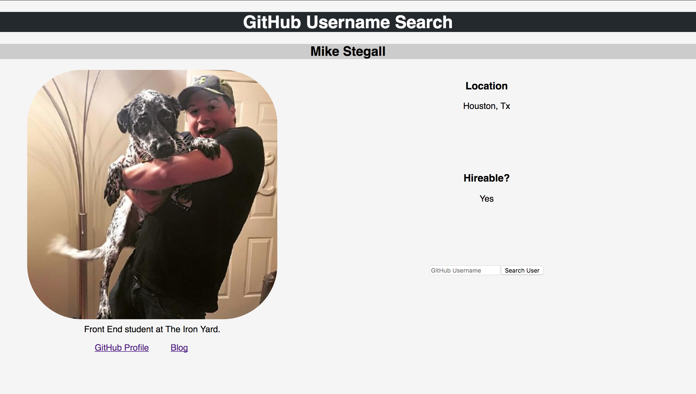

# Github Username Search React App
This is the first app I have created using React.

[GitHub API Project]

I split nearly each DOM element that is rendering into separate files and I am importing those files into my main file. When you put a username in the search field then it will find the username if it is valid if it is not then it will let you know.

Built this app using functions instead of classes.

#### Challenges

The challenges with this app is that it was the first React App that I have made. It is used with functional and stateless components. State at the time was a big issue for me to try and understand and work with. It was not until the end of this project that I finally understood it and how state worked and how to manage the state.

#### The things that have been pulled from GitHub are:
* Avatar
* Username
* Location
* Bio
* Link to GitHub Profile
* Blog

#### Tools/Framework
* HTML
* CSS
* jQuery
* [React]

[React]:https://github.com/facebookincubator/create-react-app
[GitHub API Project]:http://github-api-app.surge.sh/
